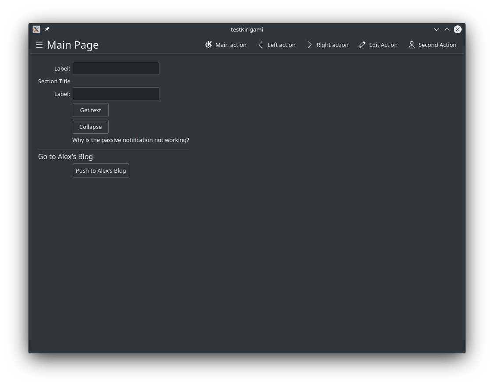

# testKirigami
This project is a personal journey of learning how to use the Qt toolkit, KDE Frameworks, Kirigami and C++ to create cross platform applicatons.


# Building
Type the following commands in the terminal
```
mkdir build
cd build
cmake ..
make
./src/testKirigami
```


# Current
The application looks like the following picture. The pictures can be found in Gallery folder.

