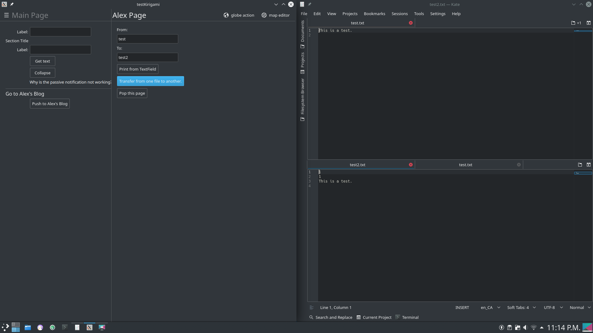

# testKirigami
This project is a personal journey of learning how to use the Qt toolkit, KDE Frameworks, Kirigami and C++ to create cross platform applicatons.


# Building
Type the following commands in the terminal
```bash
$ mkdir build
$ cd build
$ cmake ..
$ make
$ ./src/testKirigami
```


# Current State
The pictures can be found in the GALLERY folder.

The application looks like the following picture.


The application can copy contents of one file to another. The first two lines of the second file is to check if the files were opened successfully.

