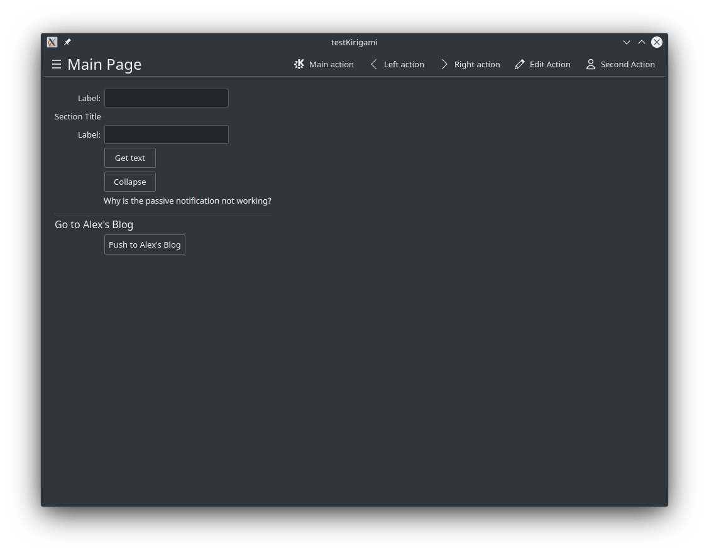
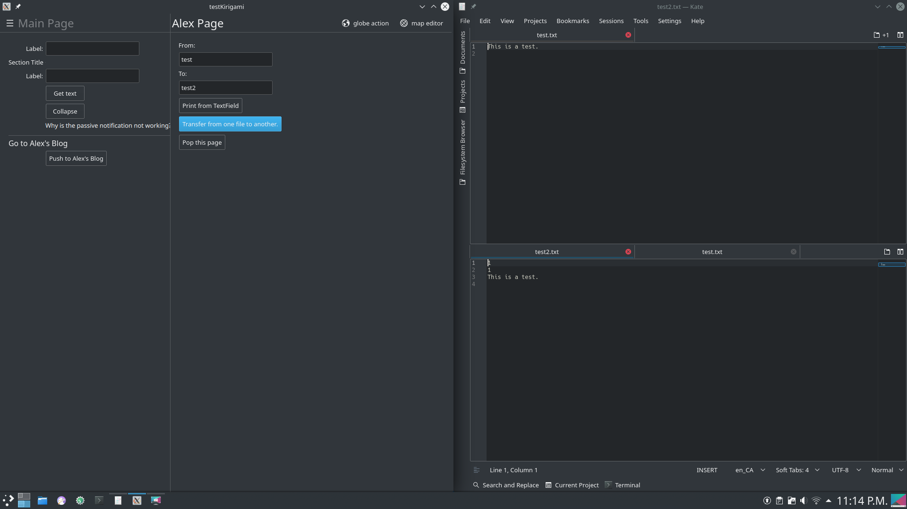

# Timeline

### Before 2019-08 (August 2019)
Started project in Feburary. I did not use a version control system at the time. I did not make a log/journal/diary of this project.

### 2019-08 - 2019-11
Used git and github. None of my contributions show as my own as I did not set up my sshkeys with github. Still no log/journal/diary.

### 2019-11-17 - 2019-11-20
Was able to assign commits to me. Still no log/journal/diary.

### 2019-11-20
Was able to finally connect C++ to QML and be able to press a button in qml and have a cout something to the terminal.
Originally it only output to the terminal when exiting the program then something happened, probably added test.txt or more likely did a deleted the build directory and did a clean build. After this cout was outputting to the terminal right when I press a button instead of when I quit the program.

### 2019-11-21
Was abile to load data from a text file on disk and then output and save it to a second text file. The first two lines of the second file is to check if the files were opened successfully. Found out one must use QString when working with Qt/QML and cannot send C++ std::string from QML to C++. I can now send text from the textfield within the same page using a button to C++. The textfield must have an id to do this. I have not tried to get information from other pages using this method yet. My guess is that it will not work because I could not access the ids from elements in other pages, I will look into it though.

